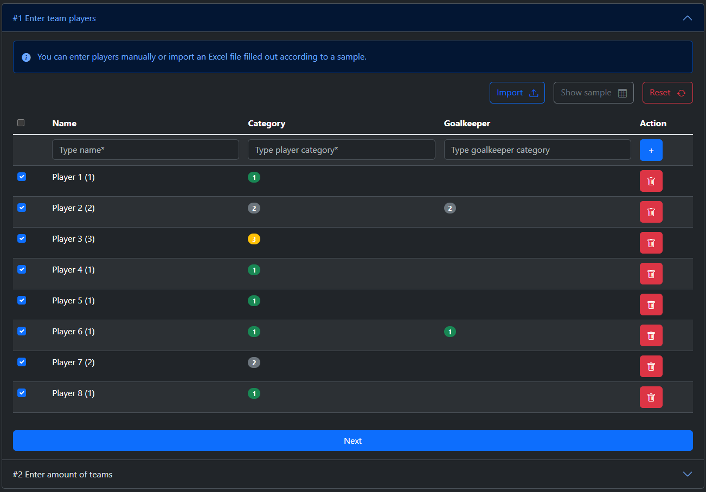
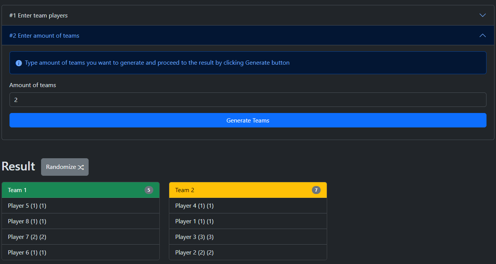

# Advanced Team Generator

A JavaScript application that allows you to load an Excel file containing player information, create checkboxes for each player, and generate teams based on player coefficients.

## Problem solved

As an amateur football player, I often play in tournaments with friends. We have to create teams from players who joined tournament and often it takes time to select captains and generate teams. Also this can lead to unbalanced teams and unfair games.

## Features

- Load Excel File: Upload an Excel file with player data. You can download and edit provided sample file.

- Player Selection: For each player in the Excel file, checkboxes are generated. Select players who will play.

- Generate Teams: Enter the number of teams to generate, and the application will create teams based on player coefficients.

- You can randomize teams by clicking "Randomize" button.

## Demo

You can try out the application live here: https://teambalancing.com

## Usage

1. Load Excel File:
   Click the "Upload" button and select an Excel file with player information.
   The application will extract the player data.
   Player Selection:

2. For each player in the Excel file, checkboxes are created.
   Select the players you want to include in the teams.
   Generate Teams:

3. Enter the number of teams you want to create.
   Click the "Generate Teams" button.
   Teams will be generated based on player coefficients.

## Technologies Used

- HTML
- CSS (Bootstrap for styling)
- JavaScript
- xlsx library for Excel file handling

## License

This project is licensed under the **MIT License** - see the LICENSE file for details.

## Contributing

Contributions are welcome! Please create a new issue or submit a pull request if you have any suggestions, feature requests, or bug reports.

## Author

Alexander jurik - https://bento.me/alex-jurik

## Contact

If you have any questions or feedback, feel free to contact me at aleks.jurik(at)gmail.com.

## Support

- Give a ⭐️ if you like this project!
- Also, your feedback is much appreciated!
- If you found this app helpful and would like to support me, you can buy me a coffee.
   
  
